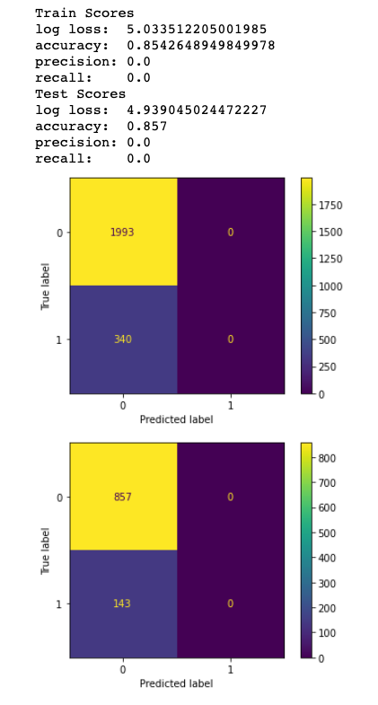
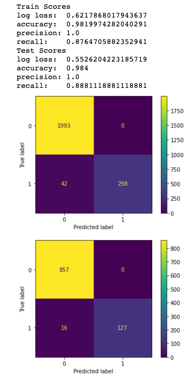
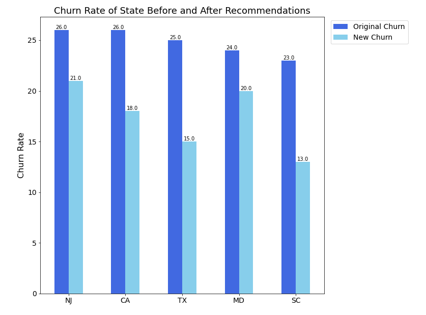

# SyriaTel Customer Churn Project

## Table of Contents
* [Overview](#Overview)
* [Business Problem](#Business-Problem)
* [Data](#Data)
* [Analysis](#Analysis)
* [Results](#Results)
* [Conclusions](#Conclusions)
* [Next_Steps](#Next-Steps)
* [Project Structure](#Project-Structure)

## Overview
Across the telecommunication industry, customer churn is one of the most important concerns that directly affect a telecommunication company's business. Hence, companies that are able to successfully predict customer churn will be able to allocate capital and resources more efficiently and thereby improve profitability. 

This project analyzes customer churn (customers leaving the provider) data from the telecommunications provider SyriaTel. The main objective of this project is to identify what type of customers were churning and develop a model that could predict whether a customer is likely to churn. SyriaTel can use this analysis to focus their efforts in modifying certain cellular plans, especially in key states such as NJ, CA, TX, MD, and SC. In addition, SyriaTel can use the model to help identify which customers are likely to churn.

## Business Problem
SyriaTel has been facing a customer churn problem. Based on a customer survey data, SyriaTel had a churn rate of ~14%, while the typical churn rate is between [0.5-5%](https://stlpartners.com/research/telco-economics-mobile-churn-rates-and-reduction-strategies/) for other mobile operators. Churn rate is very important because it is typically more expensive to obtain new customers than to retain existing customer. In order for SyriaTel to improve their churn rate, SyriaTel has tasked our team to help them predict which customers are likley to churn and provide actionable recommendations to mitigate churn.

## Data 

The dataset includes data of SyriaTel customer usage pattern and their churn status from [Kaggle](https://www.kaggle.com/becksddf/churn-in-telecoms-dataset). The data included ~3K customers with 20 columns.

Data includes:

The Target:
* churn

Features/Predictors:
* account length: the number of days the user maintains a phone plan account
* international plan: "yes" if the user has the international plan, otherwise "no"
* voice mail plan: "yes" if the user has the voice mail plan, otherwise "no"
* number of voice mail messages: the number of voice mail messages the user has sent
* total day minutes used: total number of minutes the user has been in calls during the day
* day calls made: total number of calls the user has completed during the day
* total day charge: total amount of money the user was charged by the Telecom company for calls made during the day 
* total evening minutes: total number of minutes the user has been in calls during the evening
* total evening calls: total number of calls the user has completed during the evening
* total evening charge: total amount of money the user was charged by the Telecom company for calls made during the evening
* total night minutes: total number of minutes the user has been in calls during the night
* total night calls: total number of calls the user has completed during the night
* total night charge: total amount of money the user was charged by the Telecom company for calls made during the night
* total international minutes used: total number of minutes the user has been in international calls
* total international calls made: total number of international calls the user has made
* total international charge: total amount of money the user was charged by the Telecom company for international calls made
* number customer service calls made: number of customer service calls the user has made

## Analysis

To set out on our objective of predicting which type of customers are most likely to churn, we began exploring the datatset's existing churn rate. We found that the current churn rate across all customers is 14.49%. After developing a firm understanding of the current churn rate across all customers, we then set our objective of identifying which features in a customer's phone plan most likely influences his or her churn rate. Upon identifying the key features that affect a customer's churn rate, we then wanted to directly address these features and create solutions that could decrease a customer's churn rate. Lastly, after identifying which key features help predict a customer's churn rate, we wanted to know which segment of customers to target our recommendations and solutions to reduce churn before deploying our recommendations across the entire nation. 

To build a classifier to predict whether a customer will end his or her phone plan with SyriaTel, we deployed a myriad of models to aid us in our prediction: 

* Logistic Regression Model
* K-Nearest Neighbors Model
* K-Nearest Neighbors Model with SMOTE
* Decision Tree Model
* Bagging Model with Decision Tree
* Random Forest Model
* XG Boost Model
* AdaBoost Model
* Gradient Boost Model
* Ensemble Voting Model

While it was important to assess all models based on the accuracy score, we have decided to emphasize the recall score as the main metric when assessing the prediction results of our models. As a telecommunications company with the aim of reducing customer churn, the recall score of each model was a more applicable metric as we aim to minimize the amount of false negative predictions. In the context of customer churn, we wanted to reduce the number of people that a model predicts as a customer who will not churn (hence stay with the phone company), when in actuality, the customer is likely to leave the phone company. Maximizing the recall score will ensure that the model does not miss out on any potential customers who are likely to churn and leave the phone company. 

## Results

Before assessing which model performed the best, we created a baseline dummy model which assumed the most frequent category to serve as our baseline benchmark for comparison. We found that the baseline model had an accuracy of 85% by solely predicting "no churn" across all data. Hence, with this in mind, we wanted to place more emphasis on recall rather than accuracy as our main metric when evaluating how well our model performs. Looking at the plots below, we can  see that the baseline dummy model exhibited a high log loss of 5.033  and an accuracy score of 0.854 on the training data, and a log loss of 4.939 and an accuracy score of 0.857 as well numerous false negative predictions, which we seek to minimize. 

Across all of the models listed above, we have identified that the Gradient Boost Model was the best model and the most appropriate model given its mix of high recall score and accuracy score on training data and testing data and a low log loss score. On the training data, the Gradient Boost Model exhibited a low log loss of 0.621, an accuracy of 0.981, and a recall of 0.876. On the testing data, the same model exhibited a log loss of 0.52, an accuracy of 0.984, and a recall score of 0.888. The best model also significantly reduced the amount of false negative values, down from 340 and 143 on the training and testing data for the baseline model to 42 and 16 on the training and testing data on the Gradient Boost Model.

Moving forward with the Gradient Boost Model as our best model for predicting churn, we then identified the key features importances that impacted this model the most: total charge and customer service calls. To address the impact of total charge in relation to churn, we modified the charge per minute feature and focused on the day segment of charge per minute (defined as charge_per_min_day) and found a cutoff threshold of 35 cents per minute for all customers who's total day minutes is 200 minutes. We identified 200 minutes as the 50th percentile and sought out to adjust all charge per mins to be capped at 35 cents for all customers making day calls over 200 minutes. After applying our suggested fixed fee plan, we saw that churn rate decreased from 14.49% down to 12.57%. To address the relationship between customer service calls and churn, we then identified a threshold of 0.72 that we seek to target as the ideal threshold. We then looked to create a theoretical scenario where call rate was fixed at 0.72 and a new fixed pricing fee of 35 cents per minute on calls over 200 minutes and found that churn rate improved and dropped down to around 9.81%. Lastly, we identified the 5 states with the largest churn rate as our initial subset of states to apply the suggestions of fixing charge per min at 35 cents for all day callers with over 200 minutes and a threshold of 0.72 as call satisfaction across the 5 states with the highest churn. We re-ran our Gradient Boost Model with the new applied metrics and found that we were able to lower churn rates from 26% down to 21% in NJ, 26% down to 18% in CA, 25% down to 15% in TX, 24% down to 20% in MD, and 23% down to 13% in SC.  

## Conclusions

In conclusion, we have identified two of the most import key features when predicting a customer's churn rate in our best-performing Gradient Boost Model. The first key feature with a high influence on churn rate prediction is total charge. To better assess and apply this metric on our customers to decrease the churn rate, we looked into "total day minutes" as well as "charge per minute per day" as our anlaysis concluded that call minutes made during the daytime versus that of any other time segment had a bigger impact between customers who churn and those who do not churn. We implemented a recommendation to adjust a customer's charge per minute by looking at the 50% percentile of total day minutes to determine a cut off of 200 minutes as a threshold cut off. At this cut off at the 50% percentile, we then saw that 35 cent as a charge per daytiem minutes would be an appropriate fixed rate to implement at the cut off. Hence, we recommend SyriaTel to provide all customers who make 200 minutes of calls during the day with a fixed rate plan of 35 cents per minute for day calls. 

We then identified the second important key feature when predicting a customer's churn rate, which is customer satisfaction as we discovered that customer dissatisfaction is higher amongst customers who churn. Hence identifying ways to improve customer satisfaction by lowering the customer service call rate would help reduce churn (defined as all customer service calls over total calls). We suggested implementing a targeted approach decrease the call ratio by providing better service to our customers during their customer service calls to decrease the need for customers to make any additional or future calls. 

Lastly, we then identified 5 of the states with the highest churn rate to prioritize the deployment of these suggestions. By implementing these recommendations in the top 5 states with the highest churn rate, we were able to lower the churn rate for these 5 states from a range of 23% - 26% churn down to a range of 13% to 21% churn for NJ, CA, TX, MD, and SC.  

## Next Steps

To measure whether the implementation of a flat fee of 35 cents per minute across all customers who make more than 200 mins for day calls provides the best pricing for customers, further market research on pricing plans can be conducted across SyriaTel's main competitors. In order to further improve on lowering the churn rate across all customers, we would need to collect more data from users. One way to implement a next step is to conduct a customer satisfaction survey to pinpoint more specifically other areas that can be improved upon in order to provide better customer experiences for all SyriaTel users. Lastly, after a period of 12 months, we would also like to analyze the results of the implementations across the 5 highest churning states across the nation before deploying such recommendations on a national level. We hope to see that a fixed rate plan as well as an improved customer satisfaction ratio would be observed across NJ, CA, TX, MD, and SC. 

## Repository Structure
